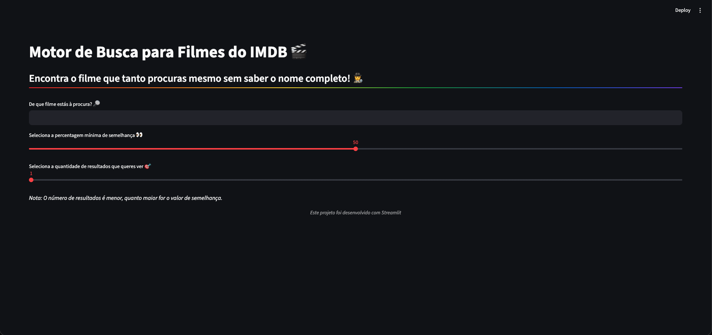
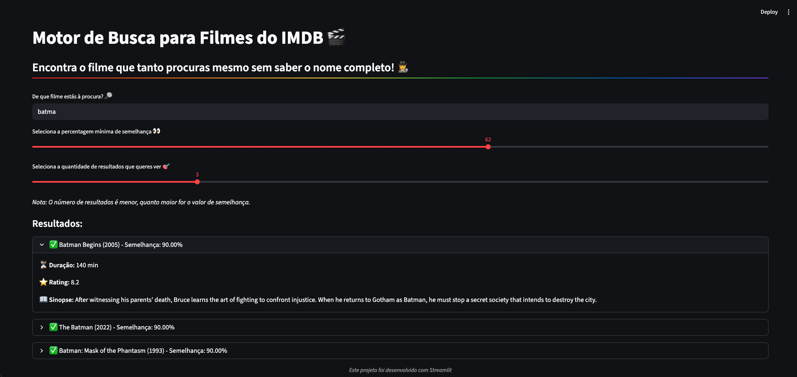

# Find Movies

Este é um projeto em Python para encontrar filmes do IMDB através de pesquisa aproximada.
Consiste num **motor de busca** em que utilizador faz a sua pesquisa do filme que deseja encontrar, e mesmo sem saber o título correto, é possível chegar ao resultado pretendido.
Os resultados provêm de um dataset do IMDB com 1000 entradas, pelo que algumas pesquisas poderão não ter correspondências.

---

# Estrutura do projeto
```
- Find_Movies/
    - data/
        - top_1000_IMDB_movies.csv
    - screenshots/
        - pagina_com_resultados.png
        - pagina_inicial.png
    - utils/
        - dados.py          # Carregamento e tratamento dos dados da pasta data/
        - pesquisa.py       # Implementação de pesquisa aproximada com RapidFuzz
                              e os seus resultados
    - app.py                # Construção da interface da app com Streamlit
    - README.md
    - requirements.txt
```

### Funcionalidades técnicas

Este projeto utiliza a biblioteca RapidFuzz, nomeadamente o algoritmo WRatio, que permite extrair o título de um filme de um _dataset_ incluído no mesmo, a partir de um título providenciado pelo utilizador.

```fuzz.WRatio```:
- Calcula um rácio comparando outros métodos de comparação de strings
- Devolve uma pontuação de semelhança entre 0 - 100

```utils.default_process```:
- Converte todos os caracteres para minúsculas
- Elimina espaços
- Elimina todos os caracteres que não sejam alfanuméricos

Ao combinar estes parâmetros com a função ```process.extract()```, é possível extrair títulos semelhantes do _dataset_, os pontos de semelhança e o índice em que se encontram.

Dentro desta função é possível definir o nível mínimo de semelhança, bem como o número de resultados pretendidos, no entanto, essa decisão fica ao encargo do utilizador através de _sliders_ criados para a _app_.

Os resultados da pesquisa são guardados numa lista, em que cada valor corresponde a um dicionário que contém informações sobreos filmes encontrados.

### Otimização de performance

A biblioteca Streamlit permite usar ```@st.cache_data```, um decorador que guarda a cache de um _dataset_.
Isto permite:
- Evitar recarregar o _dataset_ a cada interação
- Melhorar tempo de resposta
- Otimizar a performance da _app_

### Como utilizar

1) Abrir um terminal
2) Ir até à pasta do projeto:

```
cd Find_movies
```
3) Instalar as dependências do ficheiro _requirements.txt_ com o comando **pip**
(no caso de não as ter instaladas):

```
pip install -r requirements.txt
```

4) Executar a aplicação:

```
streamlit run main.py
```
A aplicação será aberta automaticamente no _browser_ pronta a utilizar.

### Interface

**Página Inicial:**


**Resultados:**


---

### Dependências
- Pandas  -> Carregamento de dados e tratamento dos mesmos
- Streamlit  -> Criação da interface do projeto
- RapidFuzz  -> Pesquisa por similaridade

## 🚀 Try it out!
Click here and try it out:
👉 [Movie Search Engine](movie-search-engine-python-b8cpcqku2kezzuviyvxnjg.streamlit.app)